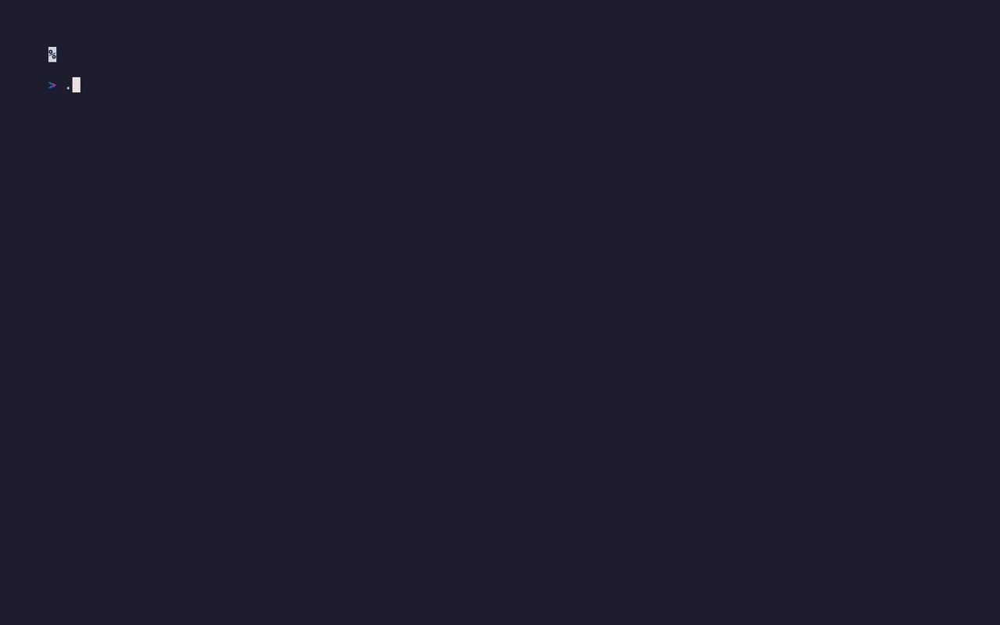
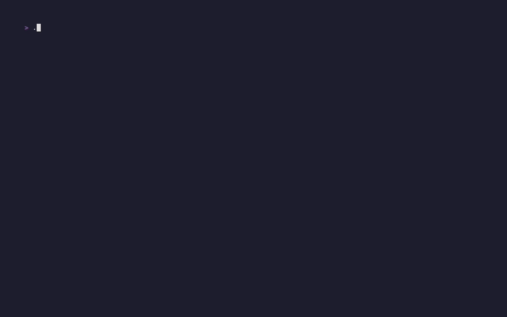

# Unicode Glyph Morphology Explorer

Unicode Glyph Morphology Explorer is a terminal browser for finding Unicode
characters by how they look.

It exists because codepoint names and script blocks are the wrong search tool
when you are building ASCII/Unicode visual effects. Sometimes you need “a thin
vertical stroke,” “a dense block,” “a diagonal ramp,” or “a family of related
shapes.” This repo renders glyphs through a pinned eight-font chain and compares
their 16×16 silhouettes by density, orientation, topology, and related visual
features.

Use it to browse candidate glyphs, inspect why they group together, and keep a
small reviewed registry of useful morphology families for ASCII-renderer work.



## Run

```sh
python3 -m pip install -r requirements.txt
./run-browser.sh --block "Geometric Shapes"
```

The interactive browser requires a UTF-8 terminal. List the known Unicode blocks without entering the browser:

```sh
./run-browser.sh --list-blocks
```

Controls are shown in the browser footer. `q` exits without changing tracked files.

## Browse discovered families



The family viewer shows reviewed glyph sequences as animated shape families.
You can switch morphology axes, filter by family length, change speed, pause on
a specific sequence, review distraction ranking, inspect authored multi-cell
combinations beside their mirrors, browse measured seam candidates, and inspect
geometry-discovered glyph runs.

```sh
./run-families.sh
```

The first run builds local ignored caches under `.run/`: the morphology feature
cache, the discovered-family catalog, the cell-feature cache for the standalone
font-chain repertoire, mined Stone Story tutorial-plate usage, seam-pair
indexes, geometry-discovered run indexes, and the measured combination gallery.
After that, the same command opens the read-only viewer directly. Use `j`/`k`
to select, `m` to change the morphology axis, `1`–`9` to filter by family
length, and `q` to exit.

## Current family registry

The tracked review registry contains 96 nonblank family records. Fifteen records
come from the current Y9-2 source artifact: twelve `cycle` records covering
Latin-1 Supplement, Arabic, Basic Latin, Latin Extended-B, Greek Extended,
Mathematical Operators, and Cherokee, plus three `stroke` records covering CJK
Strokes and Katakana.

The `cycle` records use the viewer's existing family vocabulary. The three
`stroke` records are also visible through the viewer's stroke review surface.
The full registry is in
[docs/research/ascii/glyph_audit/saved_families.jsonl](docs/research/ascii/glyph_audit/saved_families.jsonl),
with source boundaries documented in [docs/code-provenance.md](docs/code-provenance.md).

## Glyph combinations

The package includes the authored Stone Story combination seed dictionary at
`assets/glyphs/authored/glyph_combinations.v1.json`. The viewer can render those
seeds with:

```sh
python3 scripts/glyph_families_viewer.py --mode combo --dump
```

For broader review, `scripts/glyph_combo_candidates.py` enumerates every
connected two- and three-cell arrangement over the full Stone Story plate
line-art alphabet: 25 basic marks plus 4 extended marks. It reports 148,016
candidates before any manual art selection:

```sh
python3 scripts/glyph_combo_candidates.py --limit 20
```

`scripts/glyph_combo_mine.py` counts recurring combinations in the packaged
Stone Story tutorial plates. `scripts/glyph_seam_index.py` finds measured
adjacent-cell pairs across the standalone font-chain repertoire.
`scripts/glyph_run_walker.py` then walks those seam relations into
variable-length beside and stacked runs, so examples such as `_.-´`,
`` `-._ ``, `\|/`, `(‾)`, `/‾\`, `\_/`, `|` over `|`, CJK stroke chains, and
Arabic joining-form runs can be reviewed as run families rather than fixed two-
or three-cell tuples.

The one-command family viewer builds and opens the measured combination surface
too. To jump straight to it:

```sh
./run-families.sh --mode seam
```

## Included data

The repository includes the morphology browser, the read-only family viewer, the
selected saved-family registry, the glyph combination review data, the candidate
enumerator, and the pinned font chain used for rendering. It does not include
the full Asciicker engine or runtime.

Font identities, copyright metadata, license mapping, and license texts are recorded in [docs/font-provenance.md](docs/font-provenance.md) and `docs/licenses/`. Source-code identities are recorded in [docs/code-provenance.md](docs/code-provenance.md).
